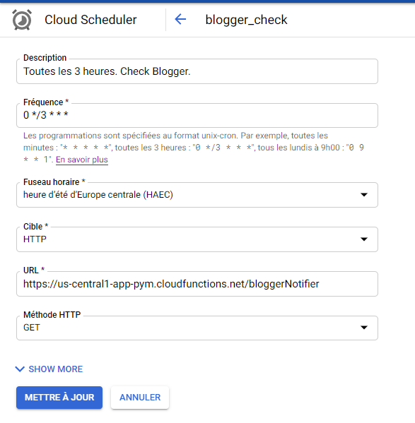
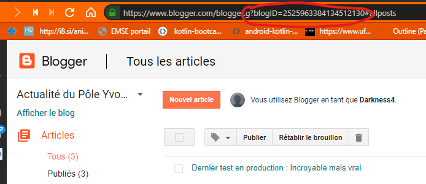
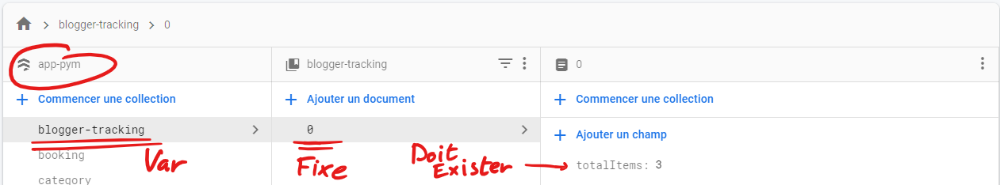

# Blogger FCM Notifier

## Principe


[**Google Cloud Schedule**](https://cloud.google.com/scheduler) envoie des requêtes HTTP GET à notre Cloud Function de manière périodique suivant la configuration utilisant [CRON](https://en.wikipedia.org/wiki/Cron).

Le Cloud Function est défini en langage JS ou TS (transpilé en JS). Le Cloud Function est le cerveau permettant de notifier les appareils.

Le Cloud Function `bloggerNotifier` réagit en fonction d'une requête HTTP GET. Si cette requête est autre que GET, celle-ci est immédiatement rejeté.

Après avoir reçu une requête GET, la fonction envoie une notification FCM **uniquement si il y a un nouveau post**. Pour détecter cette situation, la fonction sauvegarde/traque le nombre de posts du Blogger en le stockant dans ce nombre dans un Firestore (précisément `blogger-tracking/0/totalItems`).

## Setup

### Configuration de Firebase

Il faut créer un firestore avec une collection contenant un seul document (nommé 0) et contenant un unique champ `totalItems`.

Si le projet a changé de nom/chemin, il faut refaire l'initialisation de Firebase :

Installez Node 8+ : https://nodejs.org/.

```sh
npm i -g firebase-tools
```

```sh
firebase login
```

```sh
firebase init  # Ne prenez que Cloud Functions.
```

### Configuration de Google Cloud Schedule



Rien de très compliqué. Assurez vous que l'URL est bonne. (Il faut d'abord déployer la Cloud Function avant.)

### Configuration de l'environnement

Installez Node 8+ : https://nodejs.org/.

Installez Firebase Tools :

```sh
npm i -g firebase-tools
```

```sh
firebase login
```

Installez les dépendances :

```sh
cd functions
npm install
```

Configurez les variables d'environnement en exécutant dans un shell :

```sh
firebase functions:config:set env.blog_id="2525963384134512130" \
                              env.blogger_api_key="API_KEY" \
                              env.collection="blogger-tracking" \
                              env.topic="actualite"
```

- **blog_id** : ID du blog Blogger v3. Celui peut se retrouver en allant sur la page Admin de Blogger :

  

- **blogger_api_key** : Clé API Google limité à l'usage unique pour Blogger API v3.

  Il est possible de créer une clé à partir d'ici : https://console.developers.google.com/apis/credentials

  Elle est généralement sous ce format : "AIza..."

- **blogger-tracking** : Nom de la collection dans Cloud Firestore. Le Cloud Firestore doit être dans le même projet que le Cloud Function. Celui doit contenir un unique document avec ID 0.



- **topic** : Les notifications sont envoyés aux utilisateurs s'ayant s'abonné au topic. **C'est côté client qu'il faut configurer le topic.**

### Déployer

```sh
firebase deploy --only functions
```

## Architecture

### Services

#### Dépendance #1 : Blogger

```ts
export abstract class Blogger {
  abstract fetchBlog(): Promise<Blog>;
  abstract fetchLatestPost(): Promise<Post>;
}
```

Blogger récupère le blog en faisant une requête vers `https://www.googleapis.com/blogger/v3/blogs/${this.blogID}?key=${this.key}`.

Blogger récupère le dernier post en faisant une requête vers `https://www.googleapis.com/blogger/v3/blogs/${this.blogID}/posts?key=${this.key}`

`blogID` et `key` sont configurés selon la partie [Configuration de l'environnement](#configuration-de-l'environnement).

Documentation de l'API : https://developers.google.com/blogger/docs/3.0/getting_started

#### Dépendance #2 : Firestore

```ts
export abstract class FirestoreService {
  abstract getTotalItems(): Promise<number>;
  abstract postTotalItems(totalItems: number): Promise<FirebaseFirestore.WriteResult>;
}
```

Firestore récupère le nombre de post sauvegardé issue de la dernière requête. Cette valeur est utilisé pour comparer avec celui de Blogger. La requête de firestore cible `[PROJECT_ID]/{this.collection}/0/totalItems`.

Firestore doit donc sauvegarder le nombre de post afin de voir s'il y a un nouveau post.

`collection` est configuré selon la partie [Configuration de l'environnement](#configuration-de-l'environnement).

`PROJECT_ID` est le projet Google.

#### Dépendance #3 : FCM

```ts
export abstract class FcmService {
  abstract notifyListeners(post: Post, topic: string): Promise<messaging.MessagingTopicResponse>;
}
```

Celui-ci envoi une notification à un topic.

`topic` est configuré selon la partie [Configuration de l'environnement](#configuration-de-l'environnement).

Payload :

```json
{
  "notification": {
    "title": "Nouvelle article !",
    "body": post.title ?? ""
  },
  "data": {
    "kind": post.kind ?? "",
    "id": post.id ?? "",
    "published": post.published ?? "",
    "updated": post.updated ?? "",
    "url": post.url ?? "",
    "selfLink": post.selfLink ?? "",
    "title": post.title ?? "",
    "content": post.content ?? ""
  }
}
```

`post` est le dernier post de Blogger.

### Models

Les models sont issue de Blogger API v3.

Documentation de l'API : https://developers.google.com/blogger/docs/3.0/getting_started

### Business Logic (index.ts)

La première partie du code consiste à lire les variables d'environnement.

La deuxième partie injecte les dépendances.

La troisième partie consiste du corps de la Cloud Function.

La Cloud Function vérifie que la requête reçu est bien HTTP GET, puis ensuite elle compare le `totalItems` de Blogger et le `totalItems` de Firestore. Si il s'avère être différent, Firestore se met à jour et `FCMService` envoie une notification.

Dans les cas dites négative, une erreur HTTP 500 (Internal Server Error) sera envoyé avec l'erreur en question.

# License

```txt
MIT License

Copyright (c) 2020 Marc NGUYEN

Permission is hereby granted, free of charge, to any person obtaining a copy
of this software and associated documentation files (the "Software"), to deal
in the Software without restriction, including without limitation the rights
to use, copy, modify, merge, publish, distribute, sublicense, and/or sell
copies of the Software, and to permit persons to whom the Software is
furnished to do so, subject to the following conditions:

The above copyright notice and this permission notice shall be included in all
copies or substantial portions of the Software.

THE SOFTWARE IS PROVIDED "AS IS", WITHOUT WARRANTY OF ANY KIND, EXPRESS OR
IMPLIED, INCLUDING BUT NOT LIMITED TO THE WARRANTIES OF MERCHANTABILITY,
FITNESS FOR A PARTICULAR PURPOSE AND NONINFRINGEMENT. IN NO EVENT SHALL THE
AUTHORS OR COPYRIGHT HOLDERS BE LIABLE FOR ANY CLAIM, DAMAGES OR OTHER
LIABILITY, WHETHER IN AN ACTION OF CONTRACT, TORT OR OTHERWISE, ARISING FROM,
OUT OF OR IN CONNECTION WITH THE SOFTWARE OR THE USE OR OTHER DEALINGS IN THE
SOFTWARE.
```
